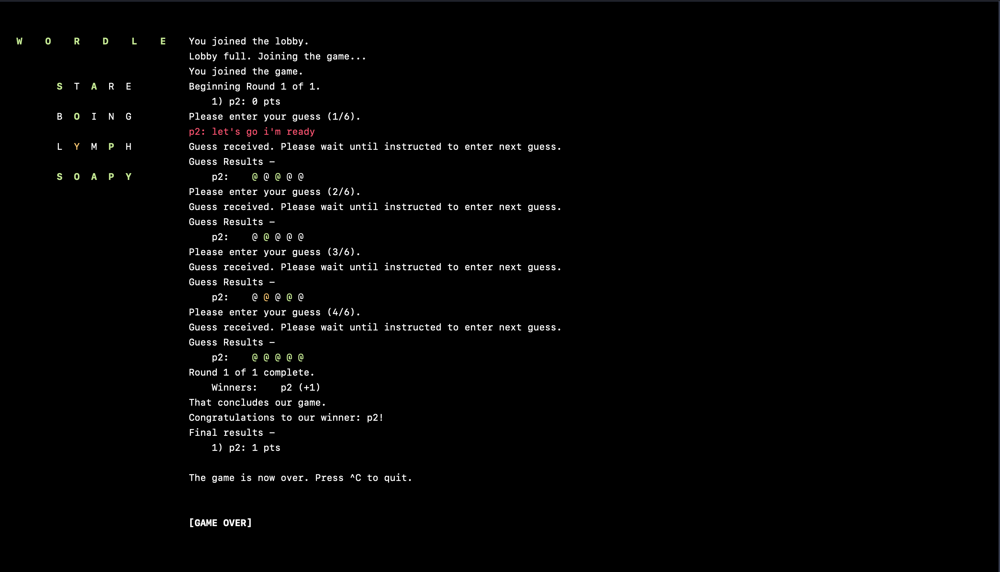

# Project 3: Multiplayer Wordle

#### Names: Jason Brown, Graham Fisher, Tommy Gallagher

To compile the code, run `make` in the Project3 directory (this may take a second as it downloads the c json processing library we used).

To run the server, run `cd mpwordleserver && ./mpwordleserver [options]` (from the Project3 directory).
To learn about available and required options, invoke `cd mpwordleserver && ./mpwordleserver -h`.

To run the client, execute `cd mpwordle && ./mpwordle [options]` (from the Project3 directory).
To learn about available and required options, invoke `cd mpwordle && ./mpwordle -h`.

## Extensions
 1) Very visually appealing client built using ncurses (via the python `curses` library).
 1) The `-to X` option on the server adds a time limit for client guesses. Uncompliant clients are kicked out of the game via a `PlayerLeave` broadcast and the game can proceed with compliant players.
 1) Using the same `PlayerLeave` mechanism, the server gracefully handles clients who disconnect during the game (e.g., try hitting ctl-C on a client during a multiplayer game) and the game can proceed with the connected players. In both this case and (2), if the number of players ever hits 0, the game server exits.
 1) The client is configured to handle `PlayerLeave` messages, letting the user know when another player has left or if they themselves have been kicked out.
 1) The client is configured to handle a `GuessDeadline` field in a `PromptForGuess` message, informing the user of their time limit and setting up a timer display.
 1) The server sends appropriate error messages to the client (error messages outside of `Result`/`Accepted`: `"Yes"`/`"No"` were not mentioned in the project description).
 1) Chat messages are colored by player in the client display.

## Limitations/Assumptions
 - The client assumes the terminal window is sufficiently large (doesn't actually have to be that big, but we recommend full screen).
 - When the client terminal window is small enough that a line of text wraps around the terminal window, the tail of this line hanging into the next is overwritten by the next line.
 - The client assumes that the maximum timeout for a guess is 999 (it can only display 3 digits of a timer).
